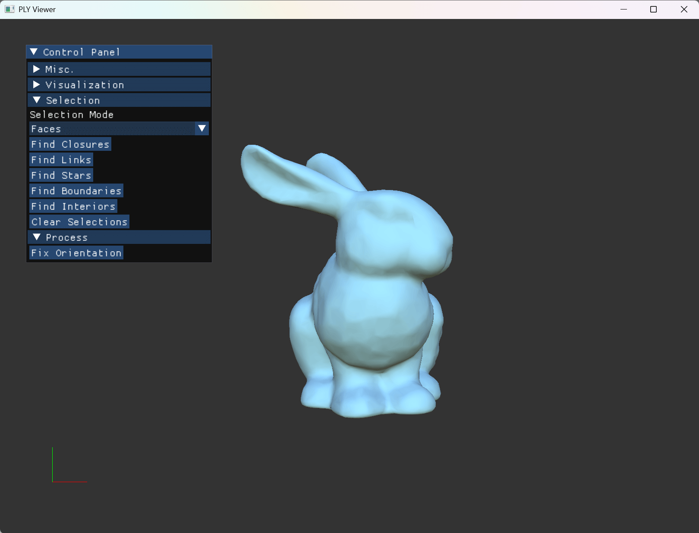

# Assignment1: LearnPLY

## Edit your functions
- meshprocessor
	- rayIntersectsTriangle
	- fixOrientation
- controller
    - selectVertices
    - selectEdges
    - findClosures
    - findLinks
    - findStars
    - findBoundaries
    - findInteriors